김현문 Network Basic Study 2024.03.06~
======================================
inflearn '널널한 개발자' '외워서 끝내는 네트워크 핵심이론 - 기초
-------------------------------------------------------------
## Section

0. [Sec 0. Intro](#sec-0-intro)
    1. [Layer와 Layered 구조](#layer와-layered-구조)
    2. [네트워크와 네트워킹](#네트워크와-네트워킹)
    3. [User mode와 Kernel mode](#user-mode와-kernel-mode)
1. [Sec 1. Internet 기반 네트워크 입문](#sec-1-internet-기반-네트워크-입문)
    1. [OSI 7 layer와 식별자](#osi-7-layer와-식별자)
    2. [Host는 이렇게 외우자](#host는-이렇게-외우자)
    3. [스위치가 하는 일과 비용](#스위치가-하는-일과-비용)
2. [Sec 2. L2 수준에서 외울 것들](#sec-2-l2-수준에서-외울-것들)
    1. [NIC, L2 Frame, LAN 카드 그리고 MAC주소](#nic-l2-frame-lan카드-그리고-mac-주소)
    2. [L2 스위치에 대해서](#l2-스위치에-대해서)
    3. [LAN과 WAN의 경계 그리고 Broadcast](#lan과-wan의-경계-그리고-broadcast)
3. [Sec 3. L3 수준에서 외울 것들](#sec-3-l3-수준에서-외울-것들)
    1. [IPv4주소의 기본 구조](#ipv4주소의-기본-구조)
    2. [L3 IP Packet으로 외워라](#l3-ip-packet으로-외워라)
    3. [Encapsulation과 Decapsulation](#encapsulation과-decapsulation)
    4. [패킷의 생성과 전달](#패킷의-생성과-전달)
    5. [계층별 데이터 단위](#계층별-데이터-단위)
    6. [★이해하면 인생이 바뀌는 TCP/IP 송·수신구조](#★이해하면-인생이-바뀌는-tcpip-송수신구조)
    7. [IP 헤더 형식](#ip-헤더-형식)
    8. [서브넷 마스크와 CIDR](#서브넷-마스크와-cird)
    9. [Broadcast IP주소](#broadcast-ip주소)
    10. [Host 자신을 가리키는 IP주소](#host-자신을-가리키는-ip주소)
    11. [TTL과 단편화](#ttl과-단편화)
    12. [인터넷 설정 자동화를 위한 DHCP](#인터넷-설정-자동화를-위한-dhcp)
    13. [ARP](#arp)
    14. [Ping과 RTT](#ping과-rtt)
4. [Sec 4. L4 수준 대표주자 TCP와 UDP](#sec-4-l4-수준-대표주자-tcp와-udp)
    1. [TCP와 UDP개요](#tcp와-udp개요)
    2. [TCP 연결 과정](#tcp-연결-과정)
    3. [TCP 연결 종료 및 상태 변화](#tcp-연결-종료-및-상태-변화)
    4. [TCP, UDP 헤더 형식](#tcp-udp-헤더-형식)
    5. [TCP '연결'이라는 착각](#tcp-연결이라는-착각)
5. [Sec 5. 웹을 이루는 핵심기술](#sec-5-웹을-이루는-핵심기술)
    1. [한 번에 끝내는 DNS](#한-번에-끝내는-dns)
    2. [URL과 URI](#url과-uri)

# Sec 0. Intro

## Layer와 Layered 구조
- 계층적 구조

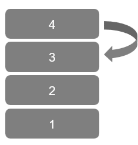

## 네트워크와 네트워킹
Network : 관계
Networking : 상호작용

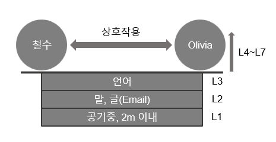

## User mode와 Kernel mode

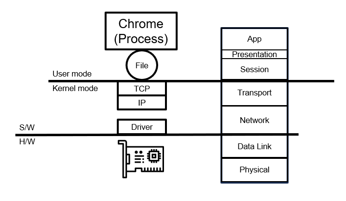

# Sec 1. Internet 기반 네트워크 입문

## OSI 7 layer와 식별자

- OSI 7 layer

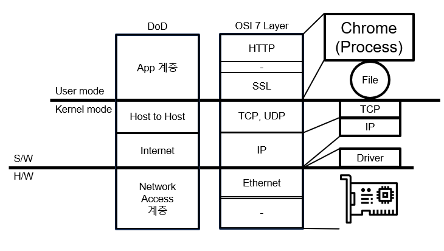

식별자
  - L2(Ethernet)
    - MAC 주소 -> LAN 카드
  - L3(Internet)
    - Host IP 주소 -> Host
  - L4(TCP, UDP)
    - Port 주소 -> Service(L3, L4)
    - Port 주소는 L2에서는 인터페이스, L4, L3에서는 Service, End- Point에선 Process의 식별자로 쓰인다.

## Host는 이렇게 외우자

Host
  - 네트워크에 연결된 컴퓨터
  - Computer + Network
Switch
  - 네트워크 그 자체를 이루는 Host
End-point
  - 네트워크 인프라를 이용하는 이용 주체(=단말기)

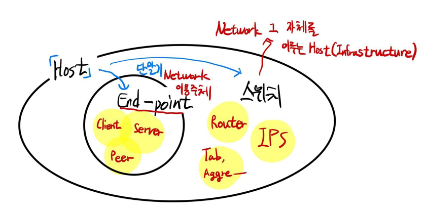

## 스위치가 하는 일과 비용

Network를 고속도로망에 비유
  - 고속도로    -> 인터넷
  - 교차로      -> 경로선택     -> Interface 선택, Switching
  - 근거        -> 이정표       -> Routing table

- 고속도로를 인터넷 망이라고 생각하면 네트워크, 즉 L3 계층이므로
  - 교차로 = L3 Switching ≒ Router
  - 이정표 = Routing Table

항상 고민해야 할 주제는 비용(Metric)

# Sec 2. L2 수준에서 외울 것들

## NIC, L2 Frame, LAN카드 그리고 MAC 주소

- NIC ≒ LAN카드
- NIC은 H/W이며 MAC주소를 갖는다.

- L2 수준의 단위 : Frame(1514 bytes, 속도 1Gbs)

LAN
  - 소규모 지역에 위치하는 호스트로 구성된 네트워크

MAC 주소
  - NI(Network Interface)에 할당된 물리적 고유 식별 주소
  - 48bits
## L2 스위치에 대해서

L2 Access Switch
  - End-point와 직접 연결되는 스위치
  - MAC 주소를 근거로 스위칭

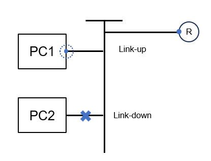

L2 Distribution Switch
  - 쉽게 생각하면 L2 Access Switch를 위한 Switch
  - VLAN 기능을 제공하는 것이 일반적

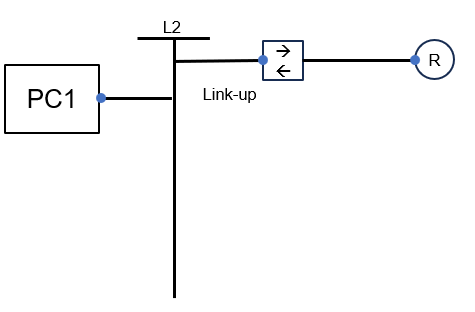

## LAN과 WAN의 경계 그리고 Broadcast

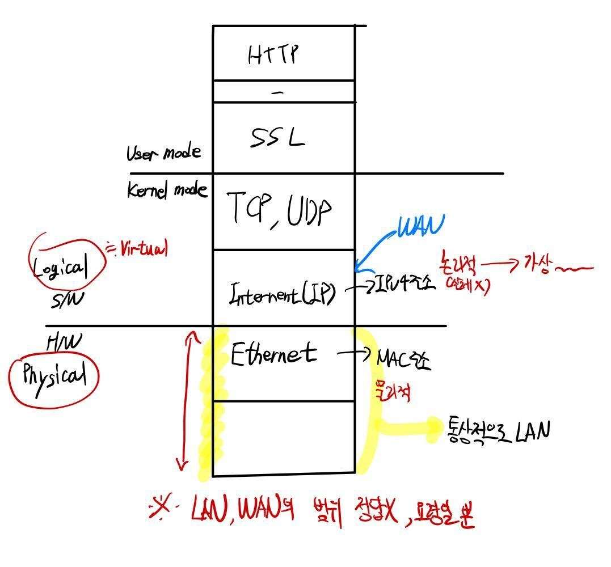

Broadcasting
  - 송신 호스트가 전송한 데이터가 네트워크에 연결된 모든 호스트에 전송되는 방식을 의미한다.(위키백과)
  - Broadcasting을 시작하면 다른 네트워크 통신이 안 되므로 범위를 최소화 해야함.
  - Broadcast 주소라는 매우 특별한 주소가 존재(Host ID가 10진수로 255)

# Sec 3. L3 수준에서 외울 것들

## IPv4주소의 기본 구조

- IPv4는 L3 계층에 위치
- 32bits
- 인터넷은 Network ID, Host ID 이 둘을 나눠서 생각한다.

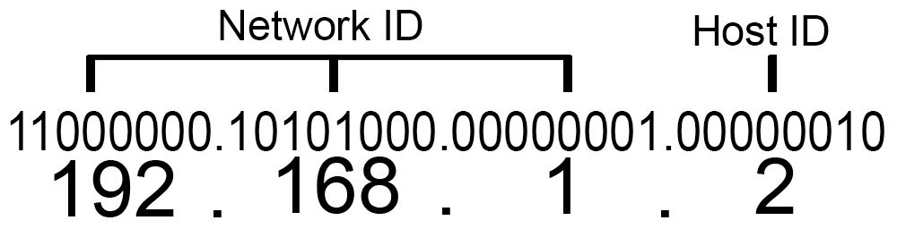

## L3 IP Packet으로 외워라

L3의 단위 데이터 : Packet
- Header와 Payload로 나뉜다.(서로 상대적)
- 최대 크기는 MTU(Maximum Transmission Unit, 1500bytes)

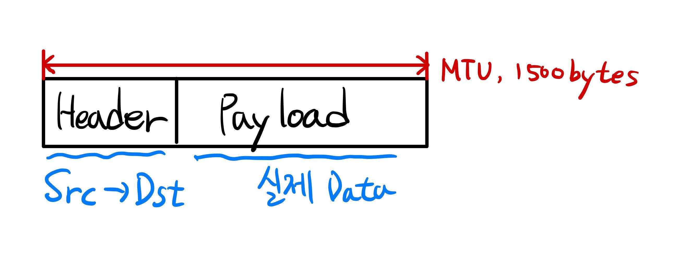

## Encapsulation과 Decapsulation

Encapsulation
  - Data를 담아서 포장
    - 내용물을 알 수 없으므로 보안성 향상

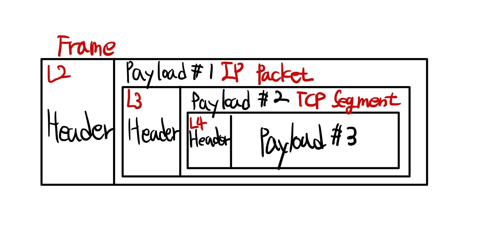

Decapsulation
  - Encapsulation의 반대

## 패킷의 생성과 전달

- 데이터를 File에 send(write)
- L4에서 Segment화
- L3에서 IP Header가 붙고 L2에서 Frame Header가 붙음
- 이더넷 Frame인 채로 나가서 L2 Access Swtich를 만나고 라우터(게이트웨이)를 타고 인터넷으로 나감

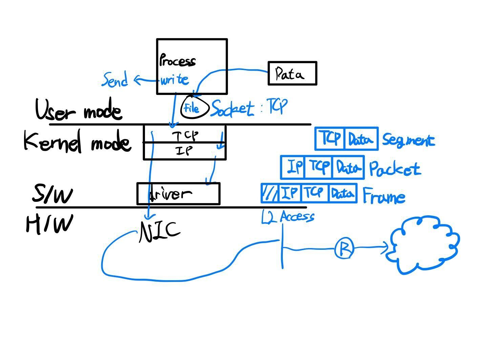

## 계층별 데이터 단위

- L1~L2 - Frame
- L3 - Packet : MTU, 1500bytes
- L4 - Segment : MSS, 1460bytes
- L5~L7 - Stream : 시작은 있지만 끝이 정확하게 정의되지 않음

- If Stream의 크기가 4MB라면 -> Segment나 Packet이 가질 수 있는 최대 크기를 넘어섬
- Segmentation이 일어남
- MSS 사이즈로 Stream을 나눠서 전달

## ★이해하면 인생이 바뀌는 TCP/IP 송·수신구조

TCP/IP 송수신
- 일정 수준의 Block Data를 Process 내부 버퍼 메모리에 담음
- I/O Buffer로 이동
- Layer 타고 내려가면서 Encapsulation
- 이동 후 수신한 쪽에서 Decapsulation
- I/O Buffer에 담고 비우면서
- Process Buffer 메모리에 담음

Network 장애
1. Loss(데이터 유실)
2. Out of Order
  - 데이터의 순서가 잘못 오는 경우
3. Re-transmission(재전송) + ACK-Duplication
  - 일정 시간 이상 ACK가 없을 경우, 송신 측에서 re-transmission을 하게 되고   
  이때, 이전에 보냈던 ACK가 re-transmission을 보내는 동시에 도착한다면, 수신 측에서는 같은 데이터를 한 번 더 받게 된다.
4. Zero Window
  - 수신 Buffer의 여유 공간이 부족한 경우

## IP 헤더 형식

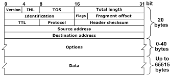

- Version : IPv4를 쓰면 0100(4) IPv6를 쓰면 0110(6)
- IHL : IP Header Length, IP Header의 길이를 4bytes 단위로 나타낸다.(ex. 5 * 4bytes = 20bytes)
- Total Length : Packet의 길이
- Flags : Packet이 단편화 되었는지 아닌지 단서를 제공하는 역할
- Fragment Offset : Packet 재조립 시 분할된 Packet간의 순서를 제공하는 역할
- TTL(Time To Live) : Packet이 경유할 수 있는 최대 Hop 수

## 서브넷 마스크와 CIRD

서브넷 마스크
- Network ID와 Host ID를 구분하는 역할
- Class A - 255.0.0.0
- Class B - 255.255.0.0
- Class C - 255.255.255.0

192.168.0.10
Net ID   /Host ID

1100 0000 1010 1000 0000 0000 / 0000 1010 IP(2진수)
1111 1111 1111 1111 1111 1111 / 0000 0000 Subnet Mask
AND 연산
1100 0000 1010 1000 0000 0000 / 0000 0000

- Subnet Mask와 AND연산으로 Host ID를 잘라냄 -> 192.168.0.0

CIDR(Classless Inter-Domain Routing)
- 192.168.0.10/24 -> 24비트가 Network ID

## Broadcast IP주소

- Host ID가 모두 1인 주소
- in Class C - XXX.XXX.XXX.255

사용할 수 없는 Host ID
- 0 - 네트워크 자체를 지칭
- 1 - 보통 Gateway가 사용
- 255 - Broadcast IP 주소
- 실제로 우리가 사용할 수 있는 Host ID는 약 250개 정도이다.

# Host 자신을 가리키는 IP주소

LoopBack Address
- 127.0.0.1
- 본인의 IP 주소로 연결을 요청해도 되지만 IP 주소는 변경이 될 수 있음
- 그럴 때 LoopBack Address 사용
- IPC(Inter Process Communication)을 구현할 때 소켓을 이용해 내가 나한테 접속하는 방식으로 프로세스 간의 통신이 이루어지도록 지원할 수 있고   
이때, LoopBack Address 사용

# TTL과 단편화

인터넷은 라우터의 집합체라고 할 수 있는 논리 네트워크이다.(NND 주장)

Internet = Router + DNS

TTL
- TTL(Time To Live)는 세포의 '텔로미어' 같은 역할을 한다.
- Router간 이동을 Hop이라 하고 TTL은 최대 Hop 이동 가능 수

단편화
- MTU 크기 차이로 발생
- 보통 단편편의 조립은 수신 측 Host에서 이루어진다.

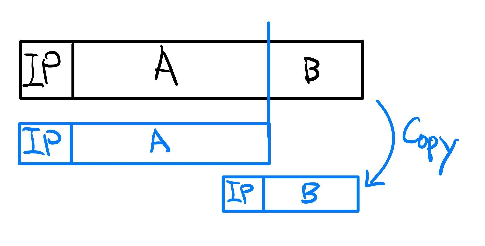

__단편화는 일어나지 않는 것이 좋다__
- 처음부터 작은 MTU 사이즈에 맞추는 것이 좋음
- 요새는 그럴 일이 거의 없지만, VPN, IPSec 이용 시 단편화가 일어날 수 있다.

# 인터넷 설정 자동화를 위한 DHCP

인터넷 사용 전에 해야 할 설정
- IP주소
- Subnet Mask
- Gateway IP주소
- DNS 주소

DHCP
- Dynamic Host Configuration Protocol
- 주소를 할당하는 서버와 할당 받으려는 클라이언트로 구성된다.
- 복잡한 인터넷 설정을 자동으로 해준다고 볼 수 있는데 핵심은 내가 사용할 IP주소를 서버가 알려준다는 것에 있다.
- Host에서 Broadcasting 방식으로 DHCP Server를 찾고 DHCP Server는 IP주소 등을 응답해준다.

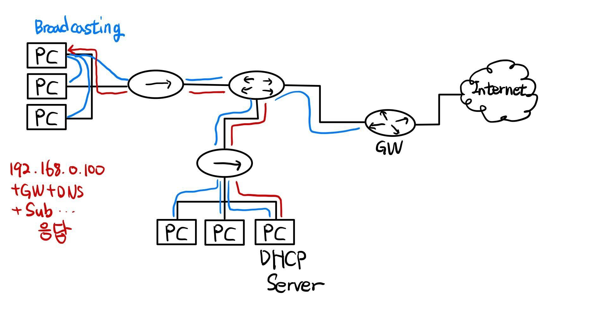

# ARP

ARP(Address Resolution Protocol)
- ARP는 IP주소로 MAC주소를 알아내려 할 때 활용된다.
- 보통의 경우 PC를 부팅하면 Gateway의 MAC주소를 찾아내기 위해 ARP Req.가 발생하며   
이에 대응하는 Reply로 MAC 주소를 알 수 있다.

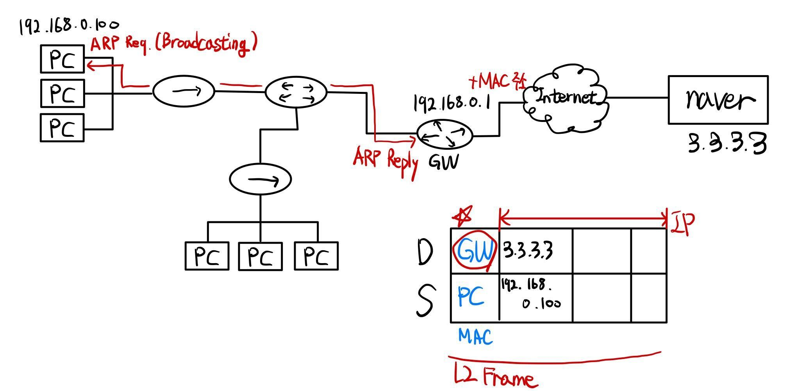

- Naver에 접속하려면 GW를 들려야 하고, 이를 위해 GW MAC주소가 필요하므로 ARP를 이용해 알아낸다.
- 한 번 MAC주소를 구한 뒤엔 Host가 주소를 Cache로 보관한다. (ARP -a 명령어로 확인 가능)

# Ping과 RTT

RTT
- 인터넷 상에서 송신지부터 목적지까지 패킷이 왕복하는데 걸리는 시간

- Ping 유틸리티는 특정 Host에 대한 RTT(Roung Trip Time)을 측정할 목적으로 사용된다.
- ICMP 프로토콜을 이용한다.
- DoS(Denial of Service) 공격용으로 악용되기도 한다.

## Sec 4. L4 수준 대표주자 TCP와 UDP

# TCP와 UDP개요

- TCP에만 연결(Connection, Session) 개념이 있다.
- 연결은 결과적으로 순서번호로 구현된다.
- 연결은 '상태(전이)' 개념을 동반한다.
- TCP는 수신 못하면 송신하지 않고, UDP는 수신에 상관없이 송신한다.

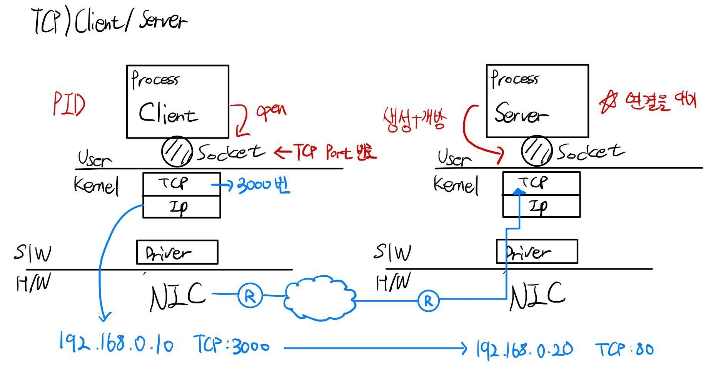

# TCP 연결 과정

3-way handshaking

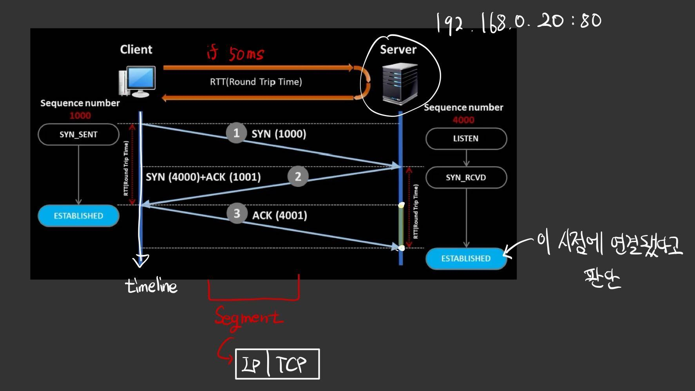

TCP 연결
- Seq 번호 교환 + 정책 교환(MSS)
- SYN-SENT
- LISTEN and SYN_RCVD
- ESTABLISH

- 연결 : 곤리적 정보, 프로토콜이 규정하는 정보를 교환하는 것
- TCP 연결은 VIrtual, 논리적 연결이다.

# TCP 연결 종료 및 상태 변화

4-way handshaking

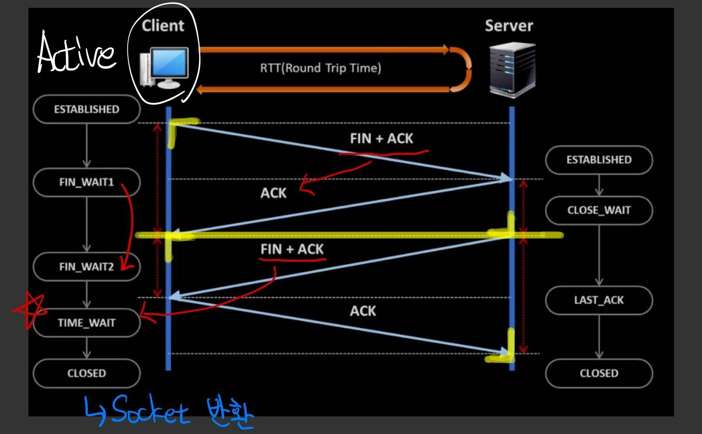

- TIME_WAIT = 연결 해제
  - 연결의 시작과 종료는 Client가 요청, Server가 요청 시 문제가 있는 것

TCP (연결) 상태 변화

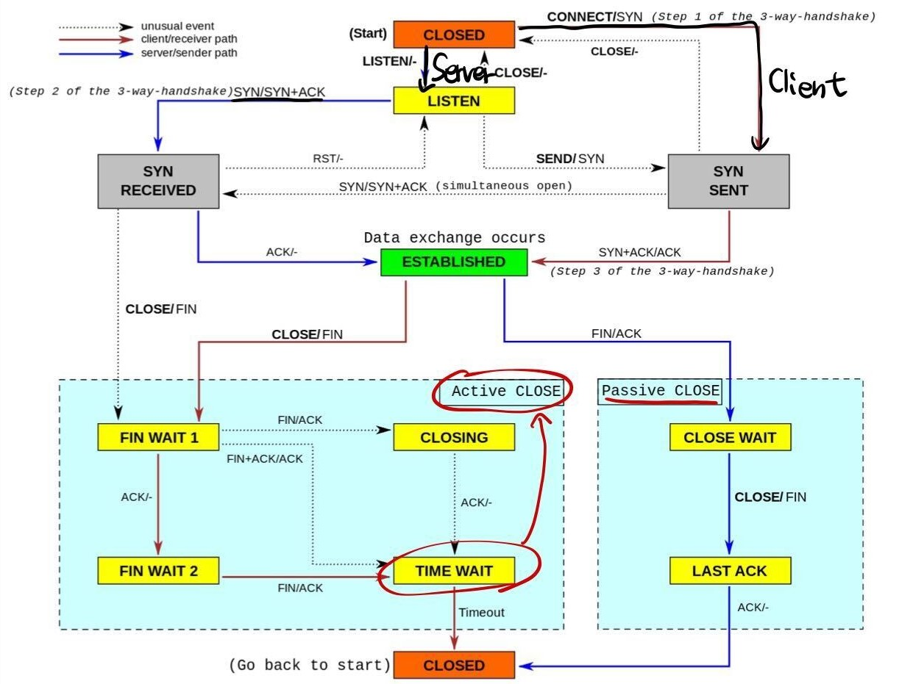

# TCP, UDP 헤더 형식

TCP 헤더 형식
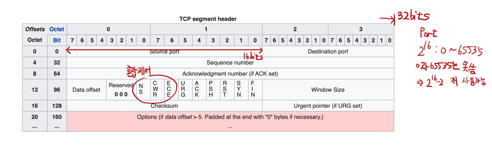

UDP 헤더 형식
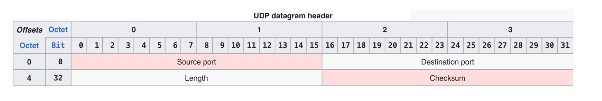

UDP 활용 - 게임서버
- TCP는 Client를 배려해 하나가 느리면 모두 하향 평준화   
UDP는 배려 X 개인만 느려짐

# TCP '연결'이라는 착각

__파일 다운로듣 중 LAN 케이블을 분리했다가 다시 연결하면 TCP 연결은 어떻게 될까?__
- TCP 연결은 일정시간 동안 유지된다.

- 재전송 타이머의 기본 근사 값은 대략 3초
- 재전송 타이머 만료 후에도 확인 응답을 받지 못한 경우 세그먼트를 재전송하고   
RTO(Retransmission Time-Out) 값은 두 배로 증가한다.
- 예를 들어 1초 > 2초 > 4초 > 8초 > 16초 간격으로 재전송한다.
- 보통 최대 5회 재전송을 시도하고 5회 이상 모두 실패한 경우 보통 전송 오류가 발생한다.
- Buffer 충격 완화

## Sec 5. 웹을 이루는 핵심기술

# 한 번에 끝내는 DNS

DNS
- 분산 구조형 데이터베이스
  - 데이터 베이스 시스템(DNS 네임 서버)의 분산 구성
  - 데이터의 영역별 구분(Domain Zone) 및 분산 정리
  - 도메인의 네임서버 및 도메인 데이터는 해당 관리 주체에 의해 독립적으로 관리됨
- 트리 구조의 도메인 네임 체계
  - Domain : 영역, 영토를 의미
  - 도메인 네임의 자율적 생성
  - 생성된 도메인 네임은 언제나 유일(Unique)하도록 네임 체계 구성

도메인 네임
- www.naver.com
  - www - Host Name
  - naver.com - Domain Name

DNS Cache
- 한 번 질의된 도메인 네임과 해당 IP주소를 캐시에 유지   
같은 질의가 오면 캐시에서 응답